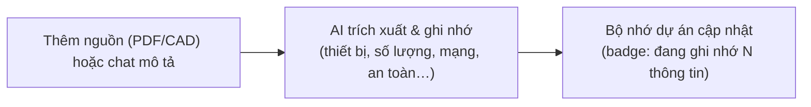
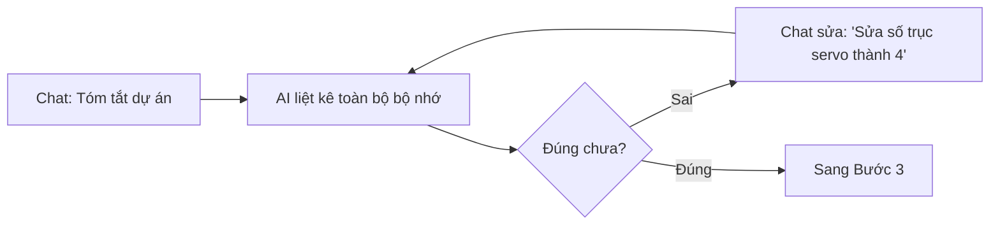
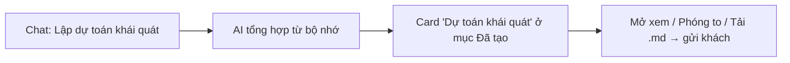
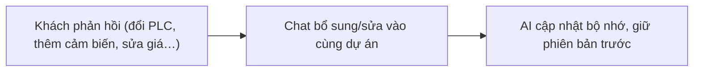
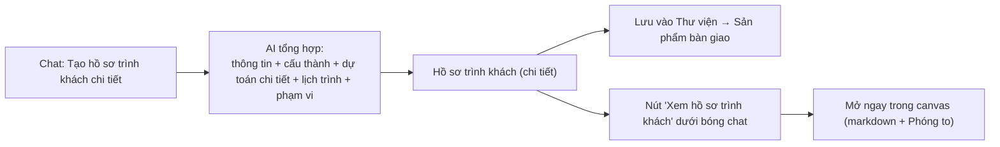
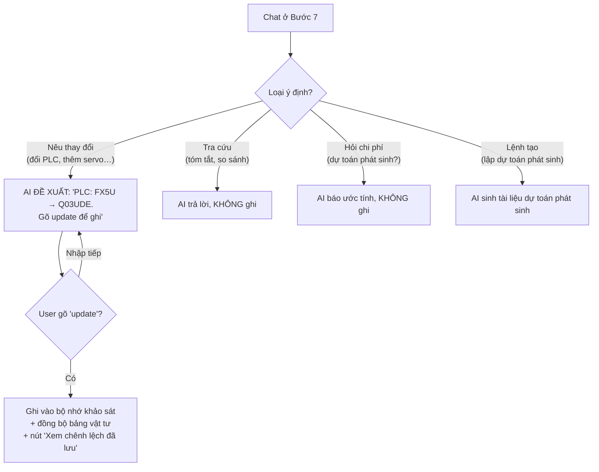

# AI-PLF — Walkthrough 13 Bước (Demo trình khách)

> Walkthrough cách nền tảng **AI-PLF** tái hiện quy trình 13 bước qua một giao diện chat AI — từ tư vấn báo giá đến nghiệm thu bàn giao.

---

## 1. Màn hình làm việc (workspace)

Mỗi dự án mở ra là một workspace **lấy chat AI làm trung tâm**, gồm 3 vùng:

```
┌───────────┬───────────────────────────┬──────────────────┐
│ SIDEBAR   │        CANVAS GIỮA         │   AI COPILOT      │
│ trái      │   (nội dung theo bước:     │   (chat phải)     │
│           │    dữ liệu / vật tư /       │                  │
│ • Nguồn   │    CAD / code / hồ sơ...)  │  • Tạo cuộc mới   │
│ • Lịch sử │                            │  • Lịch sử chat   │
│ • Quy     │                            │  • Gợi ý câu hỏi  │
│   trình   │                            │                  │
└───────────┴───────────────────────────┴──────────────────┘
```

| Vùng | Vai trò |
|---|---|
| **Sidebar trái** | Tài liệu nguồn (khách cung cấp), Lịch sử thao tác, và **Quy trình** (đang ở bước nào) |
| **Canvas giữa** | Hiển thị kết quả theo từng bước — bảng vật tư, bản vẽ, mã code, hồ sơ... |
| **AI Copilot (phải)** | **Giao tiếp chính** — chat để nhập liệu, ra lệnh, sinh đầu ra. Hỗ trợ nhiều cuộc trò chuyện. |

> **Nguyên tắc:** mọi thứ bắt đầu từ một câu chat. AI đề xuất, người dùng xác nhận.


---

## GIAI ĐOẠN 1 — PRE-SALES (Trước nhận đơn)

> **Chu trình lặp** *Nhập → Kiểm tra → Dự toán*, chạy 2 vòng:
> - **Vòng 1 (bước 1–3):** thông tin còn thô → **dự toán khái quát** để chào khách lần đầu.
> - **Vòng 2 (bước 4–6):** sau phản hồi của khách, làm rõ chi tiết → **hồ sơ trình khách** để chốt đơn.
>
> **Trong mockup:** cả 6 bước dùng **chung một màn** (CaseInput). Sidebar trái hiển thị 3 mốc *Nhập/Sửa · Kiểm tra · Trình dự toán* để biết đang ở đâu; vòng 2 là lặp lại chính 3 mốc đó với thông tin chi tiết hơn. **Toàn bộ thao tác qua chat** ở khung AI bên phải — không nhập tay form.

### 📋 Bảng lệnh chat pre-sales (dùng chung mọi bước)

| Bạn gõ (hoặc bấm chip gợi ý) | AI làm gì | Hiện ở đâu |
|---|---|---|
| `Khách hàng: Công ty A` *(dạng "Nhãn: giá trị")* | Ghi nhớ 1 trường thông tin | Bộ nhớ (số "đang ghi nhớ N" tăng) |
| Câu mô tả tự do *("dây chuyền hàn, 6 trục servo CC-Link…")* | Tự trích xuất & ghi nhớ các trường liên quan | Bộ nhớ |
| `Tóm tắt dự án` | Liệt kê toàn bộ thông tin đang nhớ | Trả lời trong chat |
| `Lập dự toán khái quát` | Sinh bảng dự toán sơ bộ | Card ở mục **"Đã tạo"** |
| `Mô tả cấu thành hệ thống (đơn giản)` | Sinh sơ đồ cấu thành | Card "Đã tạo" |
| `Lập lịch trình khái quát` | Sinh lịch trình | Card "Đã tạo" |
| `Soạn nội dung tài liệu dự toán` / `Soạn tài liệu nền đề xuất` | Sinh tài liệu nền | Card "Đã tạo" |
| `Tạo hồ sơ trình khách chi tiết` | Gom tất cả thành **hồ sơ trình khách** | **Thư viện → Sản phẩm bàn giao** + nút Xem |

---

### Bước 1 — Nhập / Sửa thông tin
- 🎯 **Giá trị:** AI tự ghi nhớ thông tin dự án từ tài liệu khách gửi + trao đổi — không cần điền form, không sợ sót.
- 👤 Nhân viên Kinh doanh / Sales Engineer
- 🔄 **Luồng:**

- 🖥️ **Tái hiện chi tiết:**
  1. Mở dự án → màn **Nhập / Sửa thông tin** (CaseInput). Sidebar trái: mốc "Nhập/Sửa" đang sáng.
  2. Bấm **"+ Thêm nguồn"** (sidebar trái) để tải tài liệu kỹ thuật khách gửi (spec PDF, bản vẽ, ảnh).
  3. Hoặc cung cấp qua chat — 2 cách:
     - **Có cấu trúc:** `Khách hàng: Công ty A` → AI: *"✓ Đã ghi nhớ Khách hàng: Công ty A"*.
     - **Tự do:** `Dây chuyền lắp ráp & kiểm tra, 6 trục servo Mitsubishi MR-J5, mạng CC-Link` → AI tự nhận diện và ghi nhớ nhiều trường, trả lời *"Mình đã ghi nhớ thêm: Thiết bị điều khiển, Cấu hình mạng…"*.
  4. Thanh trạng thái cập nhật: **"AI đang ghi nhớ N thông tin của dự án"**.
- 📤 **Kết quả:** Bộ nhớ dự án (xem bất cứ lúc nào ở **Thư viện → Bộ nhớ AI → Specs_Du_An.md**).
- 💡 **Mẹo:** không cần nhập một lần hết — cứ trao đổi dần, AI gộp lại. Sửa sai chỉ cần chat lại đúng tên trường.


---

### Bước 2 — Kiểm tra
- 🎯 **Giá trị:** Rà soát nhanh xem AI đã hiểu đúng chưa, trước khi báo giá. *(Bước tùy chọn — bỏ qua được nếu thông tin đã đủ.)*
- 👤 Kinh doanh / SE
- 🔄 **Luồng:**

- 🖥️ **Tái hiện chi tiết:**
  1. Gõ `Tóm tắt dự án` → AI trả về danh sách gọn tất cả thông tin đang nhớ (bối cảnh, thiết bị, mạng, an toàn, takt…).
  2. Đối chiếu với yêu cầu khách. Nếu sai/thiếu → sửa ngay qua chat: `Sửa: PLC là Q03UDE, không phải FX5U` hoặc bổ sung `Thêm: nhịp sản xuất 35 giây/cái`.
  3. Sidebar: mốc "Kiểm tra" sáng khi bạn hỏi tóm tắt/xem lại.
- 📤 **Kết quả:** Bộ nhớ đã được người dùng xác nhận đúng.
- 💡 **Mẹo:** đây là "trạng thái" rà soát, không phải màn riêng — AI tự nhận diện ý định "kiểm tra" và làm sáng mốc tương ứng.

---

### Bước 3 — Trình dự toán khái quát
- 🎯 **Giá trị:** Từ thông tin đã có, AI tổng hợp **dự toán sơ bộ** để chào khách vòng đầu (chốt phạm vi & ngân sách dự kiến).
- 👤 Nhân viên Kinh doanh
- 🔄 **Luồng:**

- 🖥️ **Tái hiện chi tiết:**
  1. Gõ `Lập dự toán khái quát` (hoặc bấm chip). AI sinh tài liệu → xuất hiện trong mục **"Đã tạo"** ở màn giữa.
  2. Bấm vào card để **xem trước** (render markdown: bảng hạng mục, ước tính, độ tin cậy). Bấm **Phóng to** để đọc toàn màn hình; **Tải .md** để lấy file.
  3. Có thể sinh thêm `Lập lịch trình khái quát`, `Mô tả cấu thành hệ thống` để bộ hồ sơ chào khách đầy đủ hơn.
- 📤 **Kết quả:** Dự toán khái quát (+ lịch trình/cấu thành nếu cần) — bản nháp chào khách vòng 1.
- 💡 **Mẹo:** các bản này là *bản nháp làm việc* → nằm ở "Đã tạo". Chỉ **hồ sơ trình khách (bước 6)** mới được đưa sang Sản phẩm bàn giao.


---

### Bước 4 — Nhập lại thông tin (chi tiết hơn)
- 🎯 **Giá trị:** Sau khi khách phản hồi dự toán sơ bộ, cập nhật yêu cầu mới/chi tiết — **không tạo dự án mới**, AI giữ nguyên lịch sử.
- 👤 Kinh doanh / SE
- 🔄 **Luồng:**

- 🖥️ **Tái hiện chi tiết:**
  1. Quay lại màn Nhập/Sửa, chat các thay đổi từ khách: `Đổi sang PLC iQ-R`, `Thêm 2 cảm biến quang`, `Khách muốn rút thời gian giao xuống 12 tuần`.
  2. AI ghi nhận, cập nhật bộ nhớ — **không cần làm lại từ đầu**, mọi thông tin vòng 1 vẫn còn.
- 📤 **Kết quả:** Bộ nhớ dự án phiên bản chi tiết (đầy đủ hơn vòng 1).
- 💡 **Mẹo:** vòng 4–5–6 có thể **lặp nhiều lần** đến khi khách ưng — mỗi lần chỉ là chat thêm, AI luôn giữ ngữ cảnh.

---

### Bước 5 — Kiểm tra (lần 2)
- 🎯 **Giá trị:** Xác nhận lại bản chi tiết trước khi xuất hồ sơ chốt đơn.
- 👤 Kinh doanh / SE
- 🔄 **Luồng:** `Chat "Tóm tắt dự án" → AI liệt kê bản mới nhất → đối chiếu phản hồi khách → sửa nếu cần`
- 🖥️ **Tái hiện chi tiết:** gõ `Tóm tắt dự án` → AI trả về bộ nhớ đã cập nhật (gồm các thay đổi ở Bước 4). Kiểm tra không bỏ sót yêu cầu nào của khách.
- 📤 **Kết quả:** Bộ nhớ chi tiết đã xác nhận, sẵn sàng xuất hồ sơ.
- 💡 **Mẹo:** giao diện và thao tác giống Bước 2 — khác ở chỗ dữ liệu giờ đã chi tiết.

---

### Bước 6 — Trình dự toán chi tiết → CHỐT ĐƠN
- 🎯 **Giá trị:** AI **tự gom toàn bộ thông tin đã làm rõ thành MỘT hồ sơ trình khách hoàn chỉnh** — điểm nhấn bán hàng: thay vì kỹ sư ngồi soạn, chỉ cần 1 câu chat.
- 👤 Nhân viên Kinh doanh
- 🔄 **Luồng:**

- 🖥️ **Tái hiện chi tiết:**
  1. Gõ `Tạo hồ sơ trình khách chi tiết` (hoặc `tạo tài liệu final`, `dự toán chi tiết`, `chốt đơn`).
  2. AI trả lời: *"Đã tạo 'Hồ sơ trình khách (chi tiết)' — bản tổng hợp thông tin + dự toán + lịch trình… File đã lưu vào Sản phẩm bàn giao. Bấm để xem ngay:"* + **nút `📄 Xem hồ sơ trình khách`** (ngay **dưới** bóng chat).
  3. Bấm nút → mở hồ sơ **trong canvas**: render markdown (mục 1 Thông tin · 2 Cấu thành · 3 Dự toán chi tiết (bảng) · 4 Lịch trình · 5 Phạm vi & cam kết), kèm chip **Bản V1**, nút **Phóng to**, **Tải .md**.
  4. Sửa thêm rồi tạo lại → hồ sơ **cập nhật lên V2, V3…** (không sinh file trùng). Mỗi nút chat cũ vẫn mở đúng version của lượt đó.
- 📤 **Kết quả:** **Hồ sơ trình khách (chi tiết)** trong **Thư viện → Sản phẩm bàn giao** — file chính thức gửi khách ký.
- 🔑 **Điểm chuyển giao:** khách ký hợp đồng → dự án chuyển sang **Post-sales**, mở khóa Bước 7.
- 💡 **Lưu ý:** hồ sơ final **không** nằm lẫn trong "Đã tạo" (đó là scratch) — nó là sản phẩm bàn giao, sống ở Thư viện.


---

## GIAI ĐOẠN 2 — POST-SALES (Sau nhận đơn)

> Luồng tuyến tính thực thi dự án, từ khảo sát thực tế đến nghiệm thu. *(Bước 7 thuộc nhóm "7 bước đầu" — chi tiết bên dưới; bước 8–13 ở các mục sau.)*

### Bước 7 — Khảo sát & Phát sinh
- 🎯 **Giá trị:** Sau khi khảo sát hiện trường, ghi nhận **chênh lệch thực tế** so với hợp đồng. Điểm quan trọng: **AI hỏi xác nhận trước khi ghi** — phân biệt rõ "hỏi để biết" với "ra lệnh cập nhật", tránh ghi nhầm vào hồ sơ.
- 👤 Kỹ sư dự án (SE)
- 🔄 **Luồng:**

- 📋 **Bảng lệnh chat Bước 7:**

  | Bạn gõ | AI làm gì |
  |---|---|
  | `Đổi PLC sang Q03UDE` (hoặc HMI/servo/an toàn) | **Đề xuất** ghi nhận + xin xác nhận (chưa ghi) |
  | `update` / `đồng ý` | **Ghi** đề xuất vào bộ nhớ khảo sát + đồng bộ vật tư + nút **Xem chênh lệch đã lưu** |
  | `Tóm tắt chênh lệch` / `so sánh` / `đối chiếu` | Trả lời danh sách chênh lệch — **không ghi** |
  | `Dự toán phát sinh bao nhiêu?` | Báo ước tính (vd +¥1.59M) — **không ghi** |
  | `Lập dự toán phát sinh` | Sinh tài liệu dự toán phát sinh để trình khách |

- 🖥️ **Tái hiện chi tiết:**
  1. Vào Bước 7 (màn rỗng nếu chưa khảo sát): *"Chưa có nhật ký khảo sát. Hãy chat để ghi nhận chênh lệch…"*.
  2. Gõ `Đổi PLC sang Q03UDE` → AI **đề xuất**: *"Tôi đề xuất ghi nhận — PLC: FX5U → Q03UDE. Gõ 'update' để ghi…"* (chip gợi ý đổi thành `update / Tóm tắt / Lập dự toán phát sinh`).
  3. Gõ `update` → AI: *"✓ Đã ghi 'PLC: FX5U → Q03UDE'… Bảng vật tư (Bước 9) đã đồng bộ."* + nút **`📄 Xem chênh lệch đã lưu`** (dưới bóng chat) → mở bản ghi chênh lệch trong canvas.
  4. Hỏi `Tóm tắt chênh lệch` → AI chỉ liệt kê, **không** tạo/ghi gì.
- 📤 **Kết quả:** **Bản ghi chênh lệch (trước → sau)** trong bộ nhớ khảo sát (Thư viện → Bộ nhớ AI → Khao_Sat_Phat_Sinh.txt); đồng bộ sang **bảng vật tư (Bước 9)** và **bản vẽ/code (Bước 10)**.
- 💡 **Mẹo:** nếu chỉ muốn xem mà chưa muốn ghi → cứ hỏi tự nhiên, AI không đụng vào hồ sơ. Chỉ "update" mới ghi.


---

### Bước 8 — Họp Kick-off
- 🎯 **Giá trị:** AI tự soạn biên bản kick-off, phân công & ghi chú kỹ thuật.
- 👤 Kỹ sư & PM
- 🔄 **Luồng:** `Chat ghi chú/phân công → AI cập nhật biên bản → tải .txt`
- 🖥️ **Tái hiện:** chat *"Thêm ghi chú: cáp tín hiệu cần chống nhiễu EMC"* → biên bản bên trái cập nhật.
- 📤 **Kết quả:** Biên bản Kick-off.


---

### Bước 9 — Điều chỉnh vật tư
- 🎯 **Giá trị:** Bảng vật tư thông minh — chat để chỉnh số lượng/thiết bị, AI tra Master Data, cập nhật đơn giá.
- 👤 Kỹ sư thiết kế / Sales
- 🔄 **Luồng:** `Chat "thêm 2 cảm biến quang" → AI tra Master Data → bảng vật tư cập nhật`
- 🖥️ **Tái hiện:** chat *"Nâng cấp HMI lên GOT2000 10-inch"* → bảng vật tư đổi số lượng/đơn giá.
- 📤 **Kết quả:** Bảng vật tư cập nhật (đồng bộ với chênh lệch Bước 7).


---

### Bước 10 — Thiết kế & Code tự động
- 🎯 **Giá trị:** AI sinh **bản vẽ CAD đấu dây** + **mã PLC Structured Text** từ vật tư đã chốt.
- 👤 AI / Kỹ sư kiểm tra
- 🔄 **Luồng:** `Vật tư + bộ nhớ → AI sinh CAD & ST code → xem/tải`
- 🖥️ **Tái hiện:** mở tab **CAD** / **ST Code**; tải `.dwg` và `.l5k`.
- 📤 **Kết quả:** Bản vẽ CAD + mã PLC (ở **Sản phẩm bàn giao**).


---

### Bước 11 — Debug & Hiệu chỉnh Code
- 🎯 **Giá trị:** Kiểm tra cú pháp + tối ưu mã PLC ngay trên giao diện qua chat.
- 👤 Kỹ sư / AI
- 🔄 **Luồng:** `Chat "kiểm tra lỗi cú pháp" → AI compile & báo cáo → "tối ưu/thêm tính năng"`
- 🖥️ **Tái hiện:** *"Kiểm tra lỗi cú pháp mã PLC"*, *"Thêm còi báo động vào code"* → AI sửa mã trong editor.
- 📤 **Kết quả:** Mã PLC đã rà soát/tối ưu.


---

### Bước 12 — Hiệu chỉnh tại hiện trường
- 🎯 **Giá trị:** Nạp code vào thiết bị, chạy thử; AI-PLF hỗ trợ sửa từ xa qua chat.
- 👤 Kỹ sư hiện trường
- 🔄 **Luồng:** `Nạp .l5k → chạy thử → lỗi? → quay lại Bước 11 nhờ AI sửa → nạp lại`
- 🖥️ **Tái hiện:** *(làm việc với thiết bị thật; dùng lại giao diện Bước 11 khi cần sửa code).*
- 📤 **Kết quả:** Hệ thống chạy ổn định tại hiện trường.

---

### Bước 13 — Giám sát / Nghiệm thu
- 🎯 **Giá trị:** AI tự soạn tài liệu vận hành + biên bản nghiệm thu để bàn giao.
- 👤 Khách hàng / SE
- 🔄 **Luồng:** `Chat "soạn tài liệu nghiệm thu" → AI sinh docx + pdf → tải & ký`
- 🖥️ **Tái hiện:** tải **Biên bản nghiệm thu.docx** và **Hướng dẫn vận hành HMI.pdf**.
- 📤 **Kết quả:** Bộ tài liệu bàn giao chính thức.


---

## 2. Tính năng nổi bật (xuyên suốt mọi bước)

### 📚 Thư viện dự án — một nguồn sự thật
2 nhóm rõ ràng:
- **Bộ nhớ AI** (đầu vào): đặc tả gốc + nhật ký khảo sát — nền tảng AI dùng để sinh sản phẩm.
- **Sản phẩm bàn giao** (đầu ra): hồ sơ trình khách, bản vẽ, mã nguồn, tài liệu.

Mỗi file có **lịch sử phiên bản** (V1→V2…), **so sánh trước→sau** (diff), tải về, xóa.


### 💬 Nhiều cuộc trò chuyện
Dự án dài, nhiều thành viên — mỗi chủ đề một cuộc trò chuyện riêng, có **lịch sử** (tab "Của tôi" / "Cả dự án", thời gian, đổi tên, xóa).


### ✅ Xác nhận trước khi ghi
Thông tin chỉ được lưu khi người dùng xác nhận — AI không tự ý ghi đè. Hỏi để biết ≠ ra lệnh cập nhật.

---

## 3. Bảng tóm tắt 13 bước

| Bước | Tên | Giai đoạn | Người dùng | Đầu ra chính |
|---|---|---|---|---|
| 1 | Nhập / Sửa thông tin | Pre-sales (vòng 1) | Kinh doanh | Bộ nhớ dự án |
| 2 | Kiểm tra | Pre-sales (vòng 1) | KD / SE | — |
| 3 | Dự toán khái quát | Pre-sales (vòng 1) | Kinh doanh | Dự toán sơ bộ |
| 4 | Nhập chi tiết | Pre-sales (vòng 2+) | Kinh doanh | Bộ nhớ chi tiết |
| 5 | Kiểm tra | Pre-sales (vòng 2+) | KD / SE | — |
| 6 | Dự toán chi tiết (chốt) | Pre-sales (vòng 2+) | Kinh doanh | **Hồ sơ trình khách** |
| 7 | Khảo sát & Phát sinh | Post-sales | Kỹ sư dự án | Bản ghi chênh lệch |
| 8 | Kick-off | Post-sales | Kỹ sư / PM | Biên bản kick-off |
| 9 | Điều chỉnh vật tư | Post-sales | Kỹ sư / Sales | Bảng vật tư |
| 10 | Thiết kế & Code | Post-sales | AI / Kỹ sư | CAD + mã PLC |
| 11 | Debug & Hiệu chỉnh | Post-sales | Kỹ sư / AI | Mã PLC tối ưu |
| 12 | Hiệu chỉnh hiện trường | Post-sales | Kỹ sư hiện trường | Hệ thống chạy thực tế |
| 13 | Giám sát / Nghiệm thu | Post-sales | Khách / SE | Tài liệu bàn giao |

---

## 4. Thuật ngữ nhanh

| Thuật ngữ | Giải thích |
|---|---|
| **AI Copilot** | Cửa sổ chat AI bên phải — giao tiếp chính với hệ thống |
| **Bộ nhớ dự án** | Thông tin AI tự ghi nhận, dùng xuyên suốt để sinh sản phẩm |
| **Hồ sơ trình khách** | Tài liệu tổng hợp (thông tin + dự toán + lịch trình) để chốt đơn |
| **PLC / HMI** | Bộ điều khiển lập trình / màn hình giao tiếp người-máy |
| **ST / .l5k** | Mã PLC Structured Text / file mã nguồn PLC |
| **CAD / .dwg** | Bản vẽ điện-điều khiển (AutoCAD) |

---

*Ảnh minh họa: chụp từ bản demo và đặt trong `docs/screenshots/` theo đúng tên file ở trên.*
