# Hướng Dẫn Sử Dụng — AI-PLF Platform
### Luồng Nghiệp Vụ 13 Bước

Tài liệu này hướng dẫn toàn bộ quy trình từ khi tiếp nhận yêu cầu khách hàng đến khi nghiệm thu bàn giao, sử dụng hệ thống **AI-PLF (AI-Powered PLC Factory)**.

Quy trình gồm 2 giai đoạn:
- **Giai đoạn Trước nhận đơn (Pre-sales):** Chu trình lặp 3 bước — *Nhập thông tin → Kiểm tra → Trình dự toán* — lặp lại đến khi khách hàng chốt đơn.
- **Giai đoạn Sau nhận đơn (Post-sales):** Luồng thực thi tuyến tính từ khảo sát đến nghiệm thu (Bước 7 → 13).

---

## TỔNG QUAN HỆ THỐNG

### Giao diện chính

Khi đăng nhập, màn hình **Case List** hiện ra — đây là trang chủ liệt kê toàn bộ dự án đang xử lý.

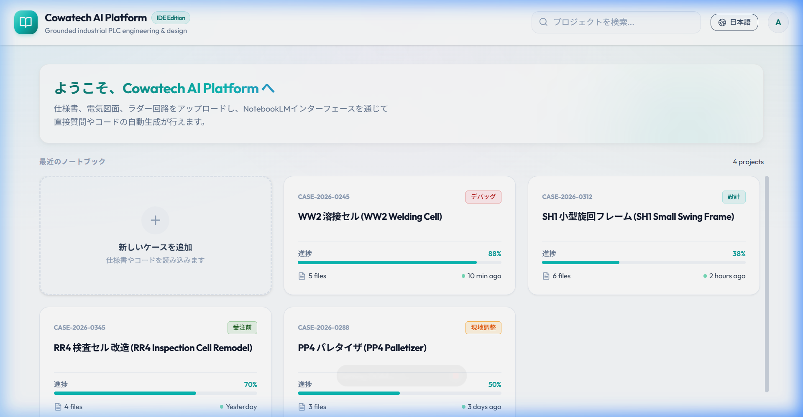

Mỗi case (dự án) khi mở ra gồm 3 vùng chính:

| Vùng | Vị trí | Chức năng |
|------|--------|-----------|
| **Thanh chu trình (Cycle Bar)** | Phía trên | Điều hướng giữa các bước trong giai đoạn hiện tại |
| **Màn hình nội dung** | Giữa | Hiển thị dữ liệu, bảng vật tư, CAD, code tùy theo bước |
| **AI Copilot** | Bên phải | Chat với AI để nhập liệu, sửa thông tin, ra lệnh |

> **Nguyên tắc vận hành:** AI đề xuất toàn bộ — người dùng chỉ review và sửa qua chat. Không cần nhập tay vào form.

---

### Hướng dẫn theo vai trò

| Vai trò | Đọc phần nào |
|---------|-------------|
| **Nhân viên Kinh doanh / Sales** | Bước 1 → 6 (Pre-sales), Bước 9 |
| **Sales Engineer (SE)** | Toàn bộ — đặc biệt Bước 2, 5, 7, 13 |
| **Kỹ sư dự án** | Bước 7 → 12 (Post-sales) |
| **Kỹ sư hiện trường** | Bước 11 → 12 |
| **Quản lý dự án (PM)** | Bước 8, 13 và Bảng tóm tắt |

---

## GIAI ĐOẠN TRƯỚC NHẬN ĐƠN (Pre-sales)
> Chu trình lặp: Nhập/Sửa → Kiểm tra → Trình dự toán. Lặp nhiều vòng đến khi chốt đơn.

### Bước 1 — Nhập / Sửa thông tin
**Mục tiêu:** AI ghi nhớ thông tin dự án để phục vụ báo giá và dự toán.

**Thao tác:**
1. Tạo dự án mới hoặc mở case hiện có từ trang Case List.
2. Tải lên các tài liệu kỹ thuật ban đầu (PDF spec, bản vẽ CAD, flow chart...) qua nút **"+ Thêm nguồn"**.
3. Chat với AI Copilot bên phải để cung cấp thêm thông tin dự án (ví dụ: *"Tóm tắt dự án này cho tôi"*, *"Sinh dự toán khái quát"*).
4. AI tự động trích xuất cấu hình thiết bị, số lượng, và các yêu cầu kỹ thuật.

**Người thực hiện:** Nhân viên Kinh doanh / Sales Engineer

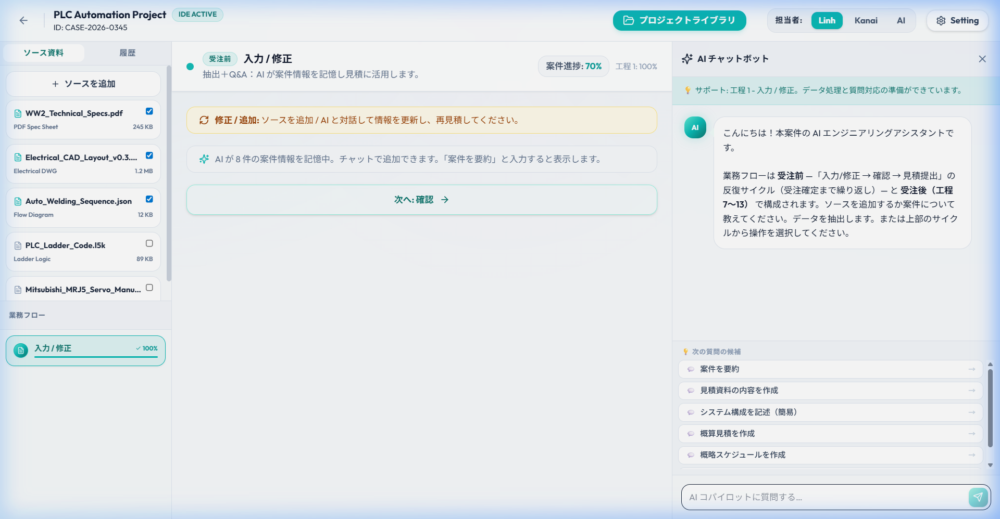

---

### Bước 2 — Kiểm tra
**Mục tiêu:** Rà soát lại dữ liệu AI đã trích xuất trước khi chuyển sang dự toán.

**Thao tác:**
1. Click tab **"Kiểm tra"** trên thanh chu trình (cycle bar) phía trên.
2. Xem lại danh sách thông tin đã trích xuất — thiết bị, số lượng, thông số kỹ thuật.
3. Nếu có sai sót, yêu cầu AI sửa lại qua chat (ví dụ: *"Sửa số lượng Servo Motor thành 3"*).
4. Bước này có thể bỏ qua nếu thông tin đã đầy đủ chính xác.

**Người thực hiện:** Nhân viên Kinh doanh hoặc SE

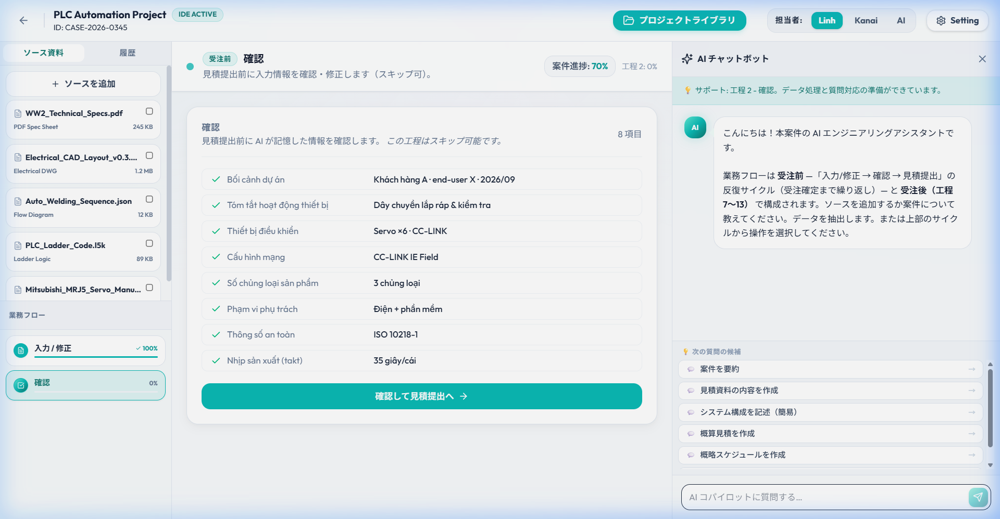

---

### Bước 3 — Trình dự toán
**Mục tiêu:** Tổng hợp các đầu ra thành hồ sơ dự toán để trình khách hàng.

**Thao tác:**
1. Click tab **"Dự toán"** trên thanh chu trình.
2. Hệ thống tự động tổng hợp thông tin thành bảng dự toán chi tiết.
3. Xuất file hồ sơ đề xuất và trình cho khách hàng.

**Người thực hiện:** Nhân viên Kinh doanh

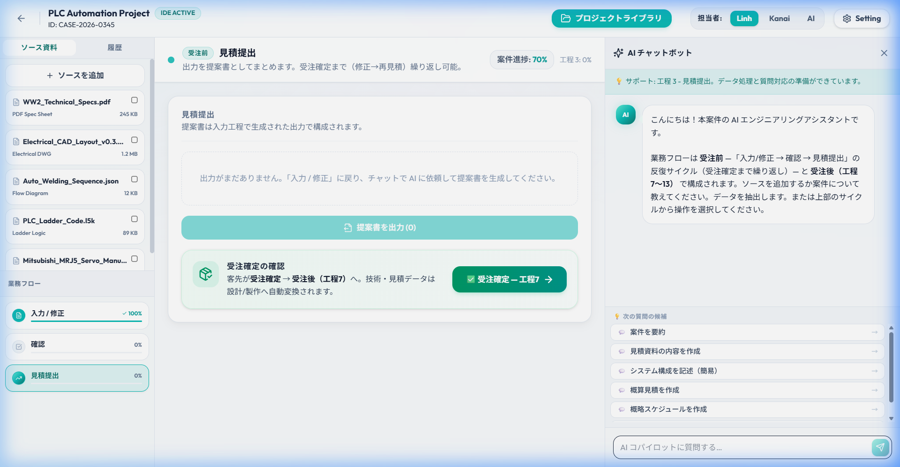

---

### Bước 4 — Nhập / Sửa thông tin (Vòng lặp 2+)
**Mục tiêu:** Cập nhật yêu cầu mới sau phản hồi từ khách hàng.

**Thao tác:**
1. Khách hàng phản hồi có yêu cầu thay đổi (đổi loại PLC, thêm cảm biến, điều chỉnh giá...).
2. Quay lại tab **"Nhập/Sửa"** và nạp thông số mới qua chat AI.
3. AI cập nhật cấu hình và ghi nhớ các thay đổi — lịch sử phiên bản trước được lưu lại.

> **Lưu ý:** Không cần tạo case mới khi có thay đổi — AI tự quản lý lịch sử chỉnh sửa trong cùng case.

**Người thực hiện:** Nhân viên Kinh doanh

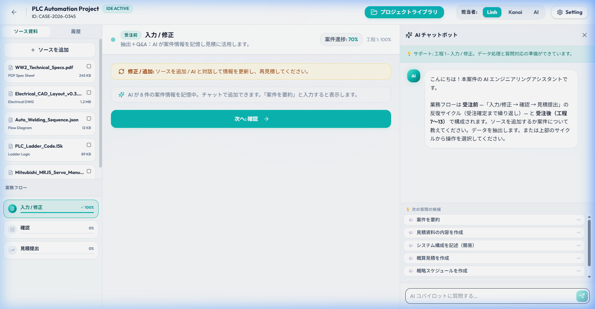

---

### Bước 5 — Kiểm tra (Vòng lặp 2+)
**Mục tiêu:** Xác nhận lại bản chỉnh sửa trước khi gửi dự toán lần 2.

**Thao tác:**
1. Click tab **"Kiểm tra"** trên thanh chu trình.
2. Đối chiếu các thay đổi so với phiên bản trước — AI tự highlight các hạng mục đã được chỉnh sửa.
3. Xác nhận không bỏ sót cấu hình quan trọng nào.
4. Nếu cần sửa thêm, dùng chat để yêu cầu AI điều chỉnh trước khi chuyển sang Bước 6.

**Người thực hiện:** Nhân viên Kinh doanh hoặc SE

*(Giao diện tương tự Bước 2)*

---

### Bước 6 — Trình dự toán (Chốt đơn)
**Mục tiêu:** Xuất bản dự toán cuối cùng, khách hàng ký hợp đồng.

**Thao tác:**
1. Click tab **"Dự toán"** — bảng dự toán tự động cập nhật theo thông tin mới nhất.
2. Xuất file dự toán cuối cùng (PDF hoặc Excel).
3. Trình khách hàng ký duyệt.
4. Sau khi khách hàng đồng ý, chuyển trạng thái case sang **"Sau nhận đơn"** (Post-sales) để mở khóa Bước 7.

> **Điểm chuyển giao quan trọng:** Từ bước này trở đi, quy trình chuyển sang tuyến tính — không còn vòng lặp Pre-sales nữa.

**Người thực hiện:** Nhân viên Kinh doanh

*(Giao diện tương tự Bước 3)*

---

## GIAI ĐOẠN SAU NHẬN ĐƠN (Post-sales)
> Luồng tuyến tính thực thi dự án. Bắt đầu từ Bước 7 sau khi chốt đơn.

### Bước 7 — Tiếp nhận & Khảo sát
**Mục tiêu:** Nhập thông số thiết bị thực tế sau đơn hàng và đối chiếu chênh lệch so với dự toán.

**Thao tác:**
1. Hệ thống tự động so sánh thông số thực tế với bản dự toán.
2. AI liệt kê danh sách các chênh lệch (ví dụ: *"Cấu hình cũ FX5U → Nâng cấp lên Q03UDE"*).
3. Kỹ sư xác nhận các thay đổi và bổ sung ghi chú khảo sát thực tế.

**Người thực hiện:** Kỹ sư dự án

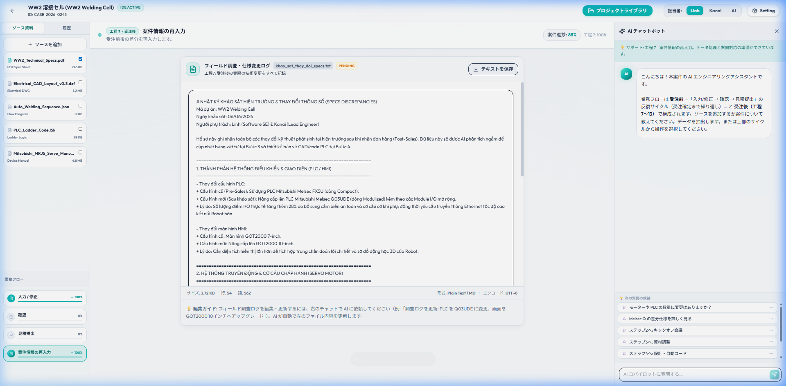

---

### Bước 8 — Họp Kick-off
**Mục tiêu:** Bàn giao thông tin dự án, ghi chú kỹ thuật giữa Sales, Kỹ sư và Khách hàng.

**Thao tác:**
1. AI tự động soạn thảo **Biên bản Kick-off** dựa trên các dữ liệu đã nhập.
2. Thêm ghi chú kỹ thuật quan trọng qua chat (ví dụ: *"Thêm ghi chú: cáp tín hiệu cần chống nhiễu EMC"*).
3. Biên bản cuộc họp hiển thị ở bên trái, có thể tải xuống file .txt.

**Người thực hiện:** Kỹ sư & Người phụ trách dự án

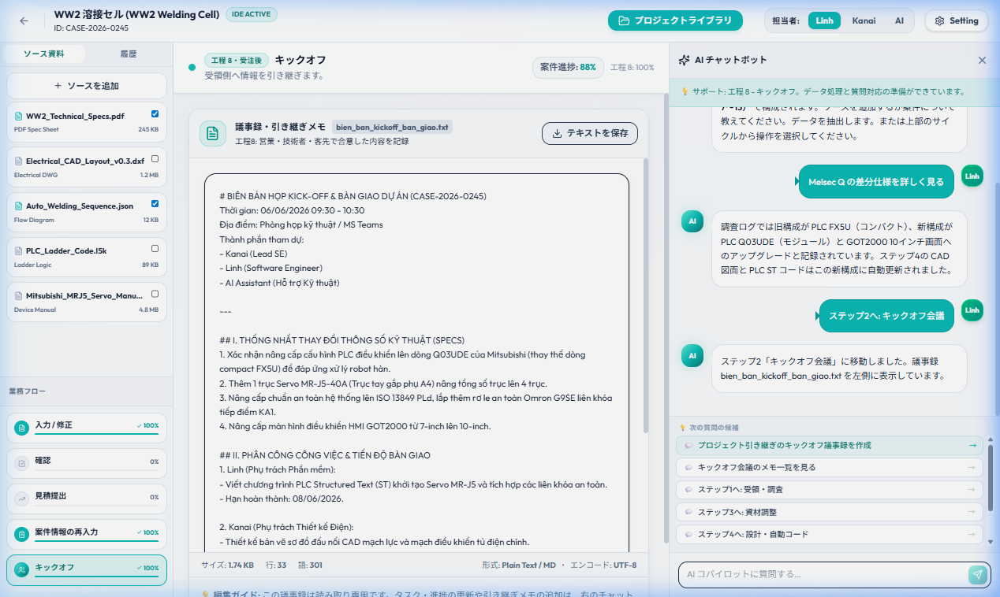

---

### Bước 9 — Điều chỉnh vật tư
**Mục tiêu:** Cập nhật danh sách thiết bị và vật tư thực tế cho dự án.

**Thao tác:**
1. Bảng vật tư thông minh hiển thị ở màn hình chính.
2. Chat với AI để điều chỉnh (ví dụ: *"Thêm 2 cảm biến quang"*, *"Nâng cấp lên HMI GOT2000 10-inch"*).
3. AI tra cứu cơ sở dữ liệu Master Data và tự động cập nhật số lượng, đơn giá.

**Người thực hiện:** Kỹ sư thiết kế / Sales

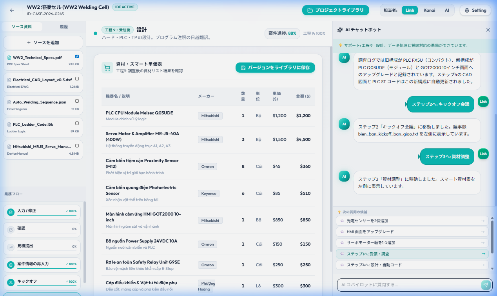

---

### Bước 10 — Thiết kế & Code tự động
**Mục tiêu:** AI tự động sinh bản vẽ sơ đồ mạch CAD và mã nguồn PLC Structured Text (ST).

**Thao tác:**
1. Hệ thống tự động sinh **Bản vẽ CAD đấu dây** và **Mã PLC ST** dựa trên vật tư đã chọn.
2. Xem trực tiếp bản vẽ CAD qua tab **"CAD"** hoặc **"ST Code"** trên màn hình.
3. Tải xuống file bản vẽ (.dwg) và file mã nguồn PLC (.l5k).

**Người thực hiện:** AI Assistant / Kỹ sư kiểm tra

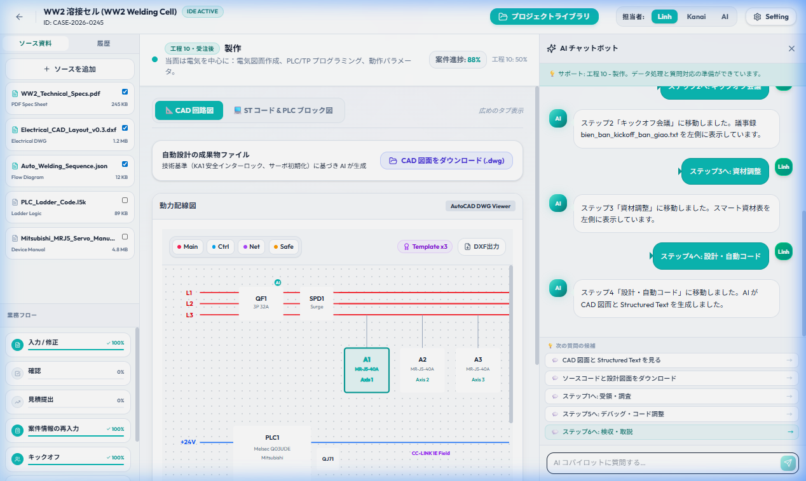

---

### Bước 11 — Debug & Hiệu chỉnh Code
**Mục tiêu:** Kiểm tra cú pháp và tối ưu mã nguồn PLC trực tiếp trên giao diện.

**Thao tác:**
1. Mã PLC ST hiển thị trực tiếp trong Editor trên màn hình.
2. Nhấn **"Kiểm tra lỗi cú pháp"** — AI chạy compiler và báo cáo kết quả.
3. Yêu cầu AI tối ưu hóa: *"Tối ưu hóa mã PLC (Paraphrase)"*.
4. Thêm tính năng mới: *"Thêm còi báo động vào code"* — AI tự chèn biến và logic.

**Người thực hiện:** Kỹ sư / AI Assistant

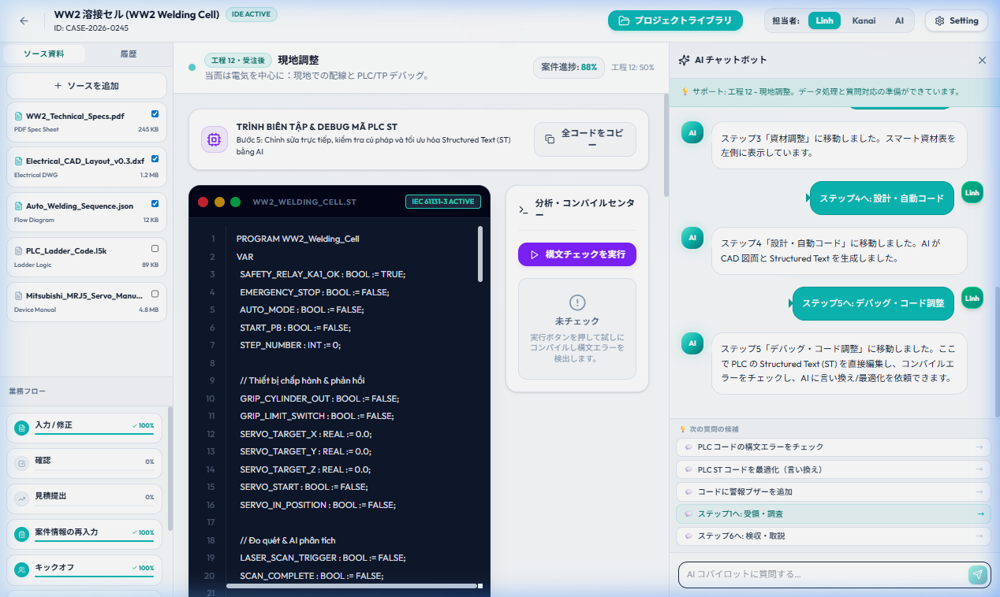

---

### Bước 12 — Hiệu chỉnh tại hiện trường
**Mục tiêu:** Đấu dây và debug PLC/TP trực tiếp tại nhà máy.

> **Lưu ý:** Bước này diễn ra ngoài hệ thống AI-PLF. Kỹ sư làm việc trực tiếp với thiết bị tại hiện trường; AI-PLF hỗ trợ từ xa qua chat nếu cần sửa code.

**Thao tác:**
1. Tải file mã nguồn PLC (.l5k) đã chốt ở Bước 11 và nạp vào thiết bị tại hiện trường.
2. Chạy thử hệ thống, ghi lại các lỗi phát sinh.
3. Nếu cần sửa code: quay lại hệ thống AI-PLF → Bước 11, yêu cầu AI hỗ trợ chỉnh sửa, tải file mới xuống.
4. Nạp lại file đã sửa vào thiết bị và kiểm tra lại.

**Người thực hiện:** Kỹ sư hiện trường

*(Giao diện tương tự Bước 11 — Debug Code)*

---

### Bước 13 — Giám sát / Nghiệm thu
**Mục tiêu:** Sinh tài liệu hướng dẫn vận hành và biên bản nghiệm thu để bàn giao chính thức.

**Thao tác:**
1. AI tự động biên soạn 2 tài liệu hoàn chỉnh:
   - 📄 **Biên bản nghiệm thu.docx**
   - 📄 **Hướng dẫn vận hành HMI.pdf**
2. Tải file về máy bằng các nút "Tải xuống" trong giao diện.
3. Ký kết và bàn giao tài liệu cho khách hàng.

**Người thực hiện:** Khách hàng / SE

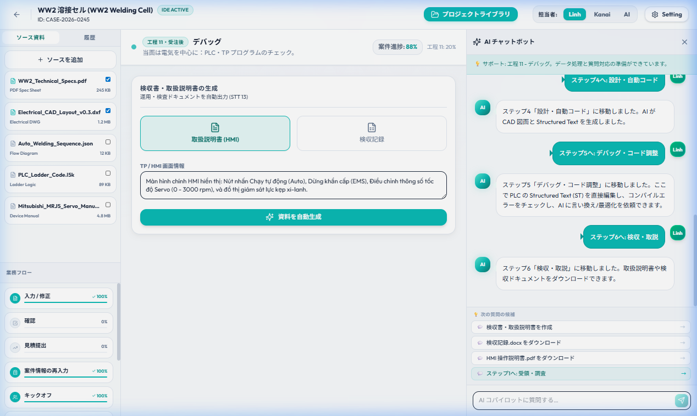

---

## Tóm tắt luồng 13 bước

| Bước | Tên bước | Giai đoạn | Người thực hiện |
|------|----------|-----------|-----------------|
| 1 | Nhập / Sửa thông tin | Pre-sales (Vòng 1) | Kinh doanh |
| 2 | Kiểm tra | Pre-sales (Vòng 1) | Kinh doanh / SE |
| 3 | Trình dự toán | Pre-sales (Vòng 1) | Kinh doanh |
| 4 | Nhập / Sửa thông tin | Pre-sales (Vòng 2+) | Kinh doanh |
| 5 | Kiểm tra | Pre-sales (Vòng 2+) | Kinh doanh / SE |
| 6 | Trình dự toán (Chốt đơn) | Pre-sales (Vòng 2+) | Kinh doanh |
| 7 | Tiếp nhận & Khảo sát | Post-sales | Kỹ sư dự án |
| 8 | Họp Kick-off | Post-sales | Kỹ sư & PM |
| 9 | Điều chỉnh vật tư | Post-sales | Kỹ sư / Sales |
| 10 | Thiết kế & Code tự động | Post-sales | AI / Kỹ sư |
| 11 | Debug & Hiệu chỉnh Code | Post-sales | Kỹ sư / AI |
| 12 | Hiệu chỉnh tại hiện trường | Post-sales | Kỹ sư hiện trường |
| 13 | Giám sát / Nghiệm thu | Post-sales | Khách hàng / SE |

---

## Câu hỏi thường gặp (FAQ)

**Q: AI trích xuất sai thông tin — phải làm gì?**
> Dùng chat AI Copilot để yêu cầu sửa trực tiếp. Ví dụ: *"Sửa lại: PLC là Q03UDE, không phải FX5U"*. Không cần tạo case mới hay nhập lại từ đầu.

**Q: Có thể bỏ qua Bước 2 (Kiểm tra) không?**
> Có. Nếu thông tin Bước 1 đã chính xác, có thể chuyển thẳng sang Bước 3. Bước 2 chỉ là checkpoint tùy chọn.

**Q: Tôi muốn quay lại sửa thông tin sau khi đã lên dự toán — có được không?**
> Được. Trong giai đoạn Pre-sales, có thể quay lại tab "Nhập/Sửa" bất kỳ lúc nào. Dự toán sẽ tự cập nhật theo thông tin mới nhất khi bạn mở lại tab "Dự toán".

**Q: File .l5k là gì? Dùng phần mềm nào để mở?**
> File `.l5k` là định dạng mã nguồn PLC của Rockwell (Allen-Bradley). Mở bằng phần mềm **Studio 5000 Logix Designer**. Xem thêm mục Thuật ngữ bên dưới.

**Q: Sau khi chốt đơn (Bước 6), có thể quay lại sửa dự toán không?**
> Không thể chỉnh sửa dự toán Pre-sales sau khi case chuyển sang Post-sales. Các thay đổi vật tư phát sinh sẽ được xử lý tại Bước 9 — Điều chỉnh vật tư.

**Q: Không tải được file xuống — liên hệ ai?**
> Liên hệ bộ phận hỗ trợ kỹ thuật Cowatech qua email hoặc kênh nội bộ của công ty.

---

## Bảng thuật ngữ (Glossary)

| Thuật ngữ | Giải thích |
|-----------|------------|
| **AI-PLF** | AI-Powered PLC Factory — tên hệ thống nền tảng của Cowatech |
| **Case** | Một dự án khách hàng trong hệ thống (tương đương "Dự án" / 案件) |
| **Cycle Bar** | Thanh điều hướng phía trên màn hình, hiển thị các tab bước trong giai đoạn hiện tại |
| **AI Copilot** | Cửa sổ chat AI ở bên phải màn hình — giao tiếp chính với AI |
| **Master Data** | Cơ sở dữ liệu thiết bị, linh kiện và đơn giá chuẩn của Cowatech |
| **PLC** | Programmable Logic Controller — bộ điều khiển logic lập trình, thiết bị tự động hóa công nghiệp |
| **HMI** | Human-Machine Interface — màn hình giao tiếp người-máy tại dây chuyền sản xuất |
| **ST / Structured Text** | Ngôn ngữ lập trình PLC chuẩn IEC 61131-3, dạng văn bản (tương tự Pascal/C) |
| **CAD / .dwg** | Bản vẽ kỹ thuật điện-điều khiển; file `.dwg` là định dạng AutoCAD |
| **.l5k** | Định dạng file mã nguồn PLC của Rockwell/Allen-Bradley, mở bằng Studio 5000 |
| **Pre-sales** | Giai đoạn trước nhận đơn: từ tư vấn đến khi khách hàng ký hợp đồng |
| **Post-sales** | Giai đoạn sau nhận đơn: từ khảo sát thực tế đến nghiệm thu bàn giao |
| **Kick-off** | Cuộc họp khởi động dự án — bàn giao thông tin giữa Sales, Kỹ sư và Khách hàng |
| **SE** | Sales Engineer — kỹ sư kinh doanh, người kết nối giữa bộ phận kỹ thuật và khách hàng |
| **GOT2000** | Dòng HMI của Mitsubishi Electric (ví dụ: GT2710-VTBA 10-inch) |
| **FX5U / Q03UDE** | Các dòng PLC của Mitsubishi Electric (FX5U: dòng nhỏ; Q03UDE: dòng trung-lớn) |
